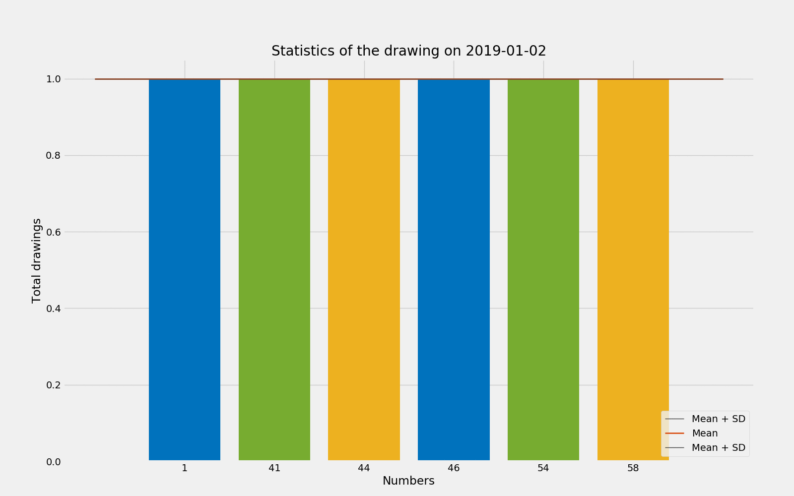

Mega-Sena
=========

The Mega-Sena is the highest paying lottery in South America and all drawing results are publicly available on the [official website](http://loterias.caixa.gov.br/wps/portal/loterias/landing/megasena/).

## Goals

The goals of this project are:

* Extract, transform and clean the raw data `(1 - Data Extraction.ipynb)`;

* Perform statistical analysis on the dataset `(2 - Statistical Analysis.ipynb)`;

* Implement an interactive plot in a Jupyter notebook`(3 - Interactive Plot.ipynb)`.

## Data Sources

* [Mega-Sena official website](http://loterias.caixa.gov.br/wps/portal/loterias/landing/megasena/)

## Installation

To create a new virtual environment with Anaconda and the `requirements.txt` file:

    $ conda create --name <env> --file requirements.txt

# Author

Victor Jose Novaes Pires

[https://victorjnpires.github.io/](https://victorjnpires.github.io/)
